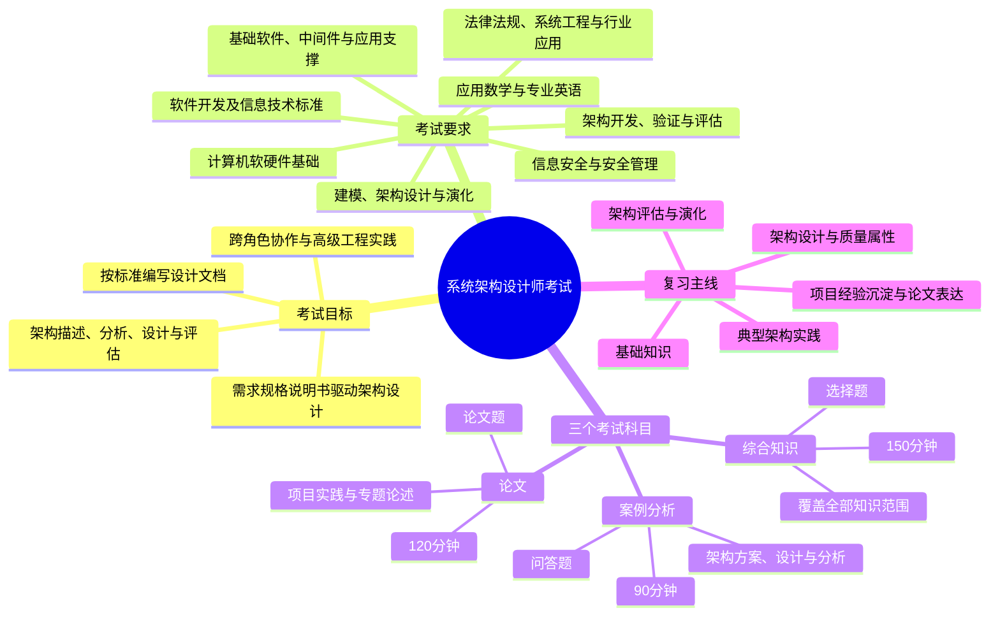

# 系统架构设计师考试全景脑图

```mermaid
mindmap
  root((系统架构设计师考试))
    考试目标
      需求规格说明书驱动架构设计
      架构描述、分析、设计与评估
      按标准编写设计文档
      跨角色协作与高级工程实践
    考试要求
      计算机软硬件基础
      架构开发、验证与评估
      软件开发及信息技术标准
      基础软件、中间件与应用支撑
      建模、架构设计与演化
      信息安全与安全管理
      法律法规、系统工程与行业应用
      应用数学与专业英语
    三个考试科目
      综合知识
        150分钟
        选择题
        覆盖全部知识范围
      案例分析
        90分钟
        问答题
        架构方案、设计与分析
      论文
        120分钟
        论文题
        项目实践与专题论述
    复习主线
      基础知识
      架构设计与质量属性
      架构评估与演化
      典型架构实践
      项目经验沉淀与论文表达
```

> 说明：考试目标、要求和科目设置来自《系统架构设计师考试大纲》（2022年审定通过）。考试策略及题型选择规则以当次官方考试通知为准。