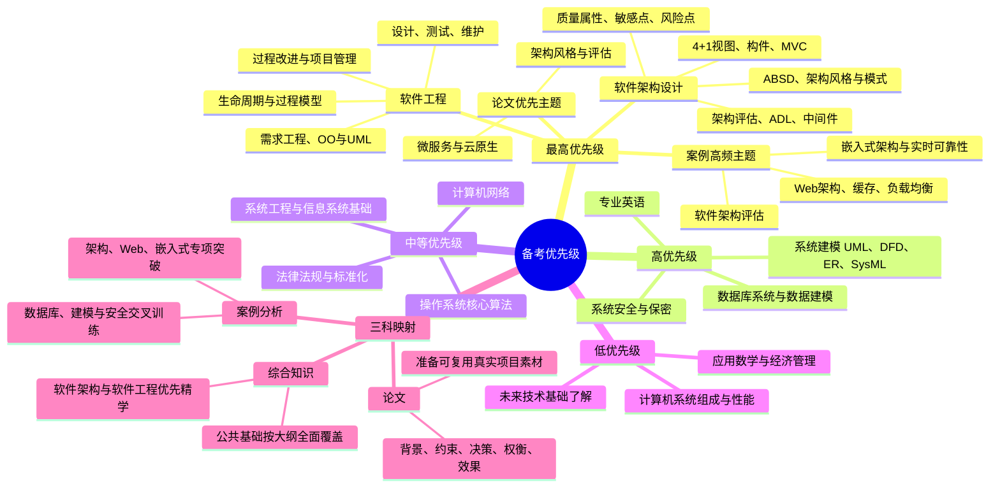

# 知识点重要程度脑图

```mermaid
mindmap
  root((备考优先级))
    最高优先级
      软件架构设计
        4+1视图、构件、MVC
        ABSD、架构风格与模式
        质量属性、敏感点、风险点
        架构评估、ADL、中间件
      软件工程
        生命周期与过程模型
        需求工程、OO与UML
        设计、测试、维护
        过程改进与项目管理
      案例高频主题
        软件架构评估
        Web架构、缓存、负载均衡
        嵌入式架构与实时可靠性
      论文优先主题
        架构风格与评估
        微服务与云原生
    高优先级
      系统安全与保密
      数据库系统与数据建模
      专业英语
      系统建模 UML、DFD、ER、SysML
    中等优先级
      系统工程与信息系统基础
      计算机网络
      操作系统核心算法
      法律法规与标准化
    低优先级
      应用数学与经济管理
      计算机系统组成与性能
      未来技术基础了解
    三科映射
      综合知识
        软件架构与软件工程优先精学
        公共基础按大纲全面覆盖
      案例分析
        架构、Web、嵌入式专项突破
        数据库、建模与安全交叉训练
      论文
        准备可复用真实项目素材
        背景、约束、决策、权衡、效果
```

> 重要程度来自仓库中的《系统架构设计师知识点重要程度汇总.md》，属于备考分析，不是官方大纲对考点的官方分级。分值与频率会随年度变化，应以当年考试情况为准。